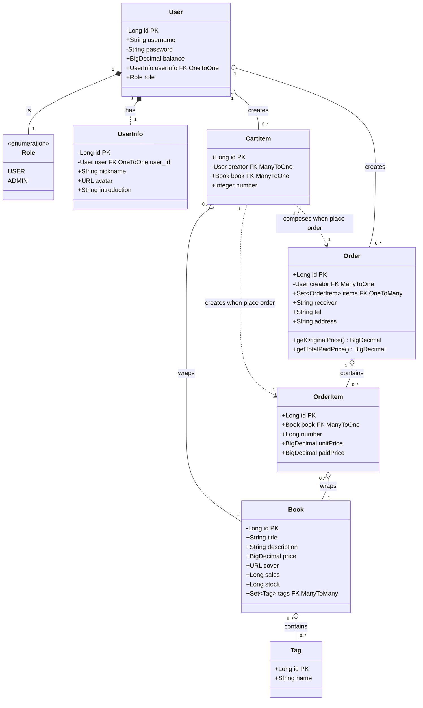

# Schema design

```mermaid
classDiagram
    class User {
        %% let it implement spring security UserDetails
        -Long id PK
        +String username
        -String password
        %% this should be handled by controller to
        %% either Personal View or User View
        +BigDecimal balance
        +UserInfo userInfo FK OneToOne
        +Role role
    }
    class Role {
        <<enumeration>>
        USER
        ADMIN
    }
    User "1" *-- "1" Role : is
    class UserInfo {
        -Long id PK
        -User user FK OneToOne user_id
        +String nickname
        +URL avatar
        +String introduction
    }
    User "1" *.. "1" UserInfo : has
    class Book {
        -Long id PK
        +String title
        +String description
        +BigDecimal price
        +URL cover
        +Long sales
        +Long stock
        +Set~Tag~ tags FK ManyToMany
    }
    class Tag {
        +Long id PK
        +String name
    }
    Book "0..*" o-- "0..*" Tag : contains
    class CartItem {
        +Long id PK
        -User creator FK ManyToOne
        +Book book FK ManyToOne
        +Integer number
    }
    CartItem "0..*" o-- "1" Book : wraps
    User "1" o-- "0..*" CartItem : creates
    class Order {
        +Long id PK
        -User creator FK ManyToOne
        +Set~OrderItem~ items FK OneToMany
        +String receiver
        +String tel
        +String address
        +getOriginalPrice() BigDecimal
        +getTotalPaidPrice() BigDecimal
    }
    class OrderItem {
        +Long id PK
        +Book book FK ManyToOne
        +Long number
        +BigDecimal unitPrice
        +BigDecimal paidPrice
    }
    OrderItem "0..*" o-- "1" Book : wraps
    CartItem "1" ..> "1" OrderItem : creates when place order
    CartItem "1..*" ..> "1" Order : composes when place order
    Order "1" o-- "0..*" OrderItem : contains
    User "1" o-- "0..*" Order : creates
```
