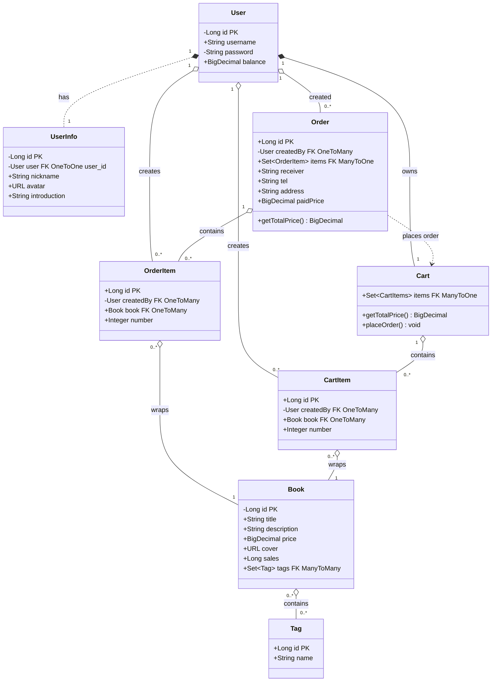

# Schema design

```mermaid
classDiagram
    class User {
        %% let it implement spring security UserDetails
        -Long id PK
        +String username
        -String password
        %% this should be handled by controller to
        %% either Personal View or User View
        +BigDecimal balance
    }
    class UserInfo {
        -Long id PK
        -User user FK OneToOne user_id
        +String nickname
        +URL avatar
        +String introduction
    }
    User "1" *.. "1" UserInfo : has
    class Book {
        -Long id PK
        +String title
        +String description
        +BigDecimal price
        +URL cover
        +Long sales
        +Set~Tag~ tags FK ManyToMany
    }
    class Tag {
        +Long id PK
        +String name
    }
    Book "0..*" o-- "0..*" Tag : contains
    class Cart {
        +Set~CartItems~ items FK ManyToOne
        +getTotalPrice() BigDecimal
        +placeOrder() void
    }
    User "1" *-- "1" Cart : owns
    class Order {
        +Long id PK
        -User createdBy FK OneToMany
        +Set~OrderItem~ items FK ManyToOne
        +String receiver
        +String tel
        +String address
        +BigDecimal paidPrice
        +getTotalPrice() BigDecimal
    }
    class OrderItem {
        +Long id PK
        -User createdBy FK OneToMany
        +Book book FK OneToMany
        +Integer number
    }
    class CartItem {
        +Long id PK
        -User createdBy FK OneToMany
        +Book book FK OneToMany
        +Integer number
    }
    OrderItem "0..*" o-- "1" Book : wraps
    CartItem "0..*" o-- "1" Book : wraps
    User "1" o-- "0..*" CartItem : creates
    User "1" o-- "0..*" OrderItem : creates
    Order "1" o-- "0..*" OrderItem : contains
    Cart "1" o-- "0..*" CartItem : contains
    User "1" o-- "0..*" Order : created
    Order ..> Cart : places order
```
